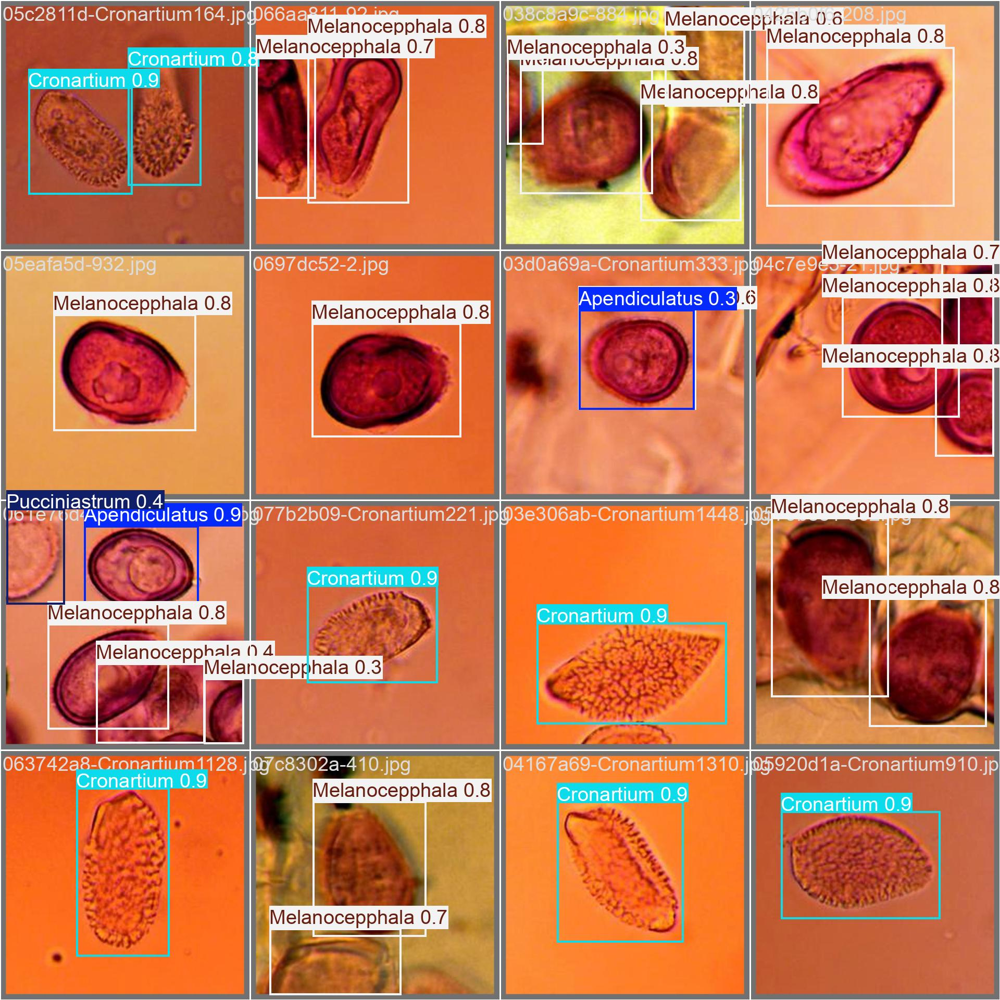
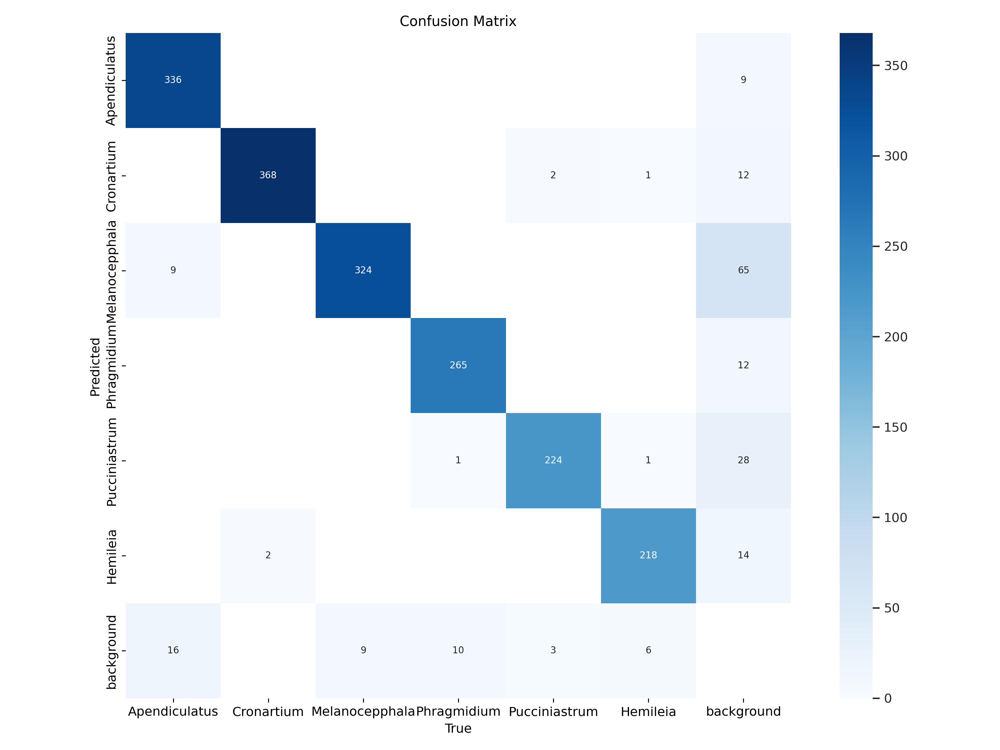
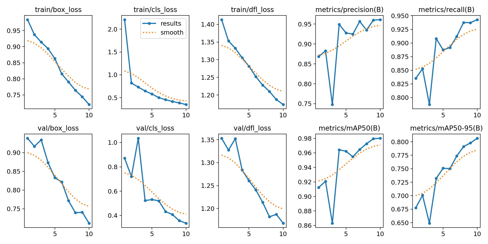

# Fungi Classification using YOLOv8 with Auto-Labeling

This project demonstrates the use of YOLOv8 for classifying fungi images with the help of auto-labeling techniques using Label Studio. The methodology includes the setup of a labeling environment, training a deep learning model, and evaluating its performance.

## Repository

The full guide for using Label Studio for auto-labeling can be found in the repository: [Import-Annotated-Data-LabelStudio](https://github.com/alxmares/Import-Annotated-Data-LabelStudio). This is a crucial resource for understanding how to automate the annotation process, which is essential for this project.

## Project Overview

The goal of this project is to classify fungi images using YOLOv8, leveraging auto-labeling techniques to create a robust and efficient pipeline for data annotation and model training.

## Methodology

### 1. Setup Label Studio for Auto-Labeling
- Create the necessary directory structure for datasets.
- Configure Label Studio to work with local files.
- Use a Python script to correct and manage label files.

### 2. Data Preparation
- Load the dataset and organize it into training and validation sets.
- Use Label Studio to annotate the images automatically.
- Validate and correct annotations as needed.

### 3. Model Training with YOLOv8
- Install the required libraries and dependencies.
- Train the YOLOv8 model on the annotated dataset.
- Monitor training progress using TensorBoard.

### 4. Model Evaluation
- Evaluate the model performance on the validation set.
- Visualize the results, including confusion matrices and sample predictions.

## Evaluation Results

## Conclusion

This project demonstrates the integration of auto-labeling techniques with deep learning models to classify fungi images efficiently. The use of YOLOv8 for training and Label Studio for annotation provides a powerful combination for developing robust image classification models.

## References

- [Import-Annotated-Data-LabelStudio](https://github.com/alxmares/Import-Annotated-Data-LabelStudio)
