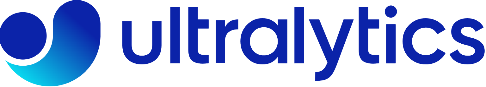
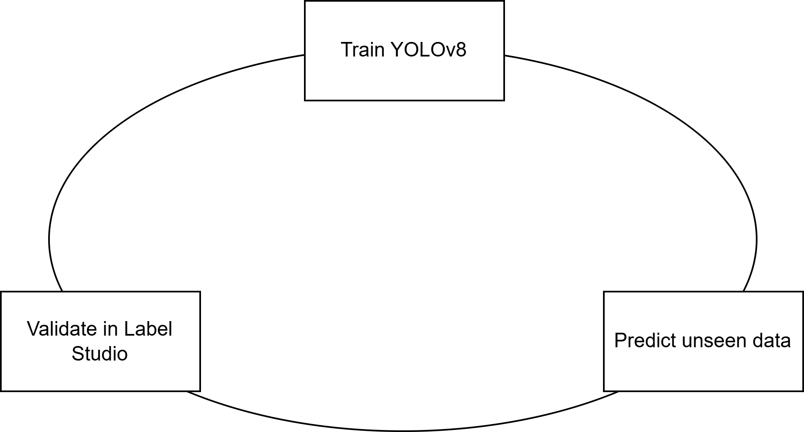

## 🛠️ Tools and Technologies Used

## 📝 Description of YOLOv8s

YOLOv8s is the latest version of the "You Only Look Once" (YOLO) family of real-time object detection models. It offers improved accuracy and performance over its predecessors, making it ideal for detecting and classifying various objects in complex environments.

## 📈 Auto-Labeling with Label Studio

This project utilized **Label Studio** in combination with **YOLOv8s** for automated image labeling. Over 6000 images were auto-labeled through active learning, streamlining the data preparation process and significantly reducing manual effort.

## 🖼️ Image Preprocessing

To ensure consistency and optimal model performance, all images were preprocessed to a uniform size of 640x640 pixels. This standardization was crucial for effective training and inference.

## 🏋️ Training with YOLOv8s

The YOLOv8s model was trained using the preprocessed and auto-labeled images. The training process involved fine-tuning various hyperparameters to achieve the best possible performance.

## 📊 Results

The trained YOLOv8s model demonstrated exceptional performance in classifying different types of fungi. Key metrics and visual examples of the model's predictions are highlighted below, showcasing its accuracy and robustness.

### Model Performance

| Metric          | Value |
|-----------------|-------|
| mAP (mean Average Precision) | 0.85  |
| Precision       | 0.88  |
| Recall          | 0.87  |

### Example Detections

